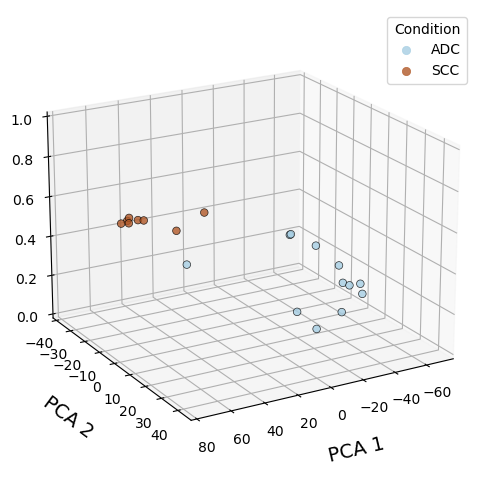
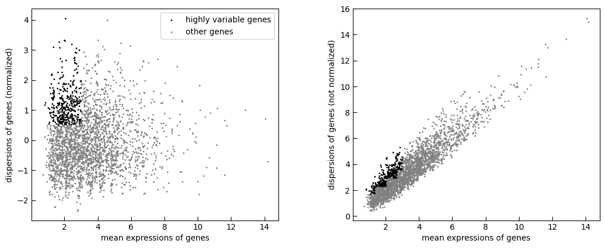
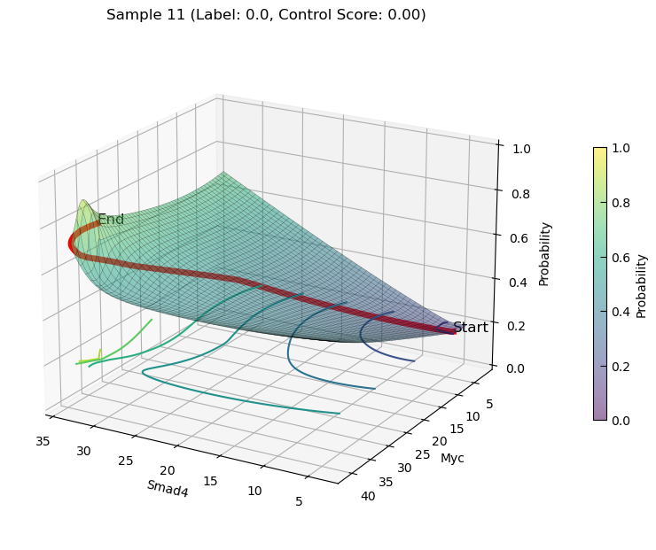
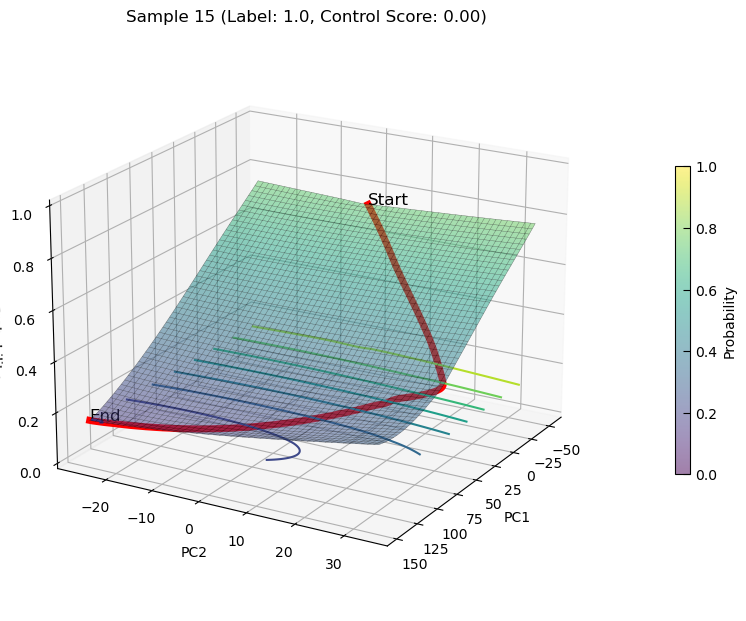
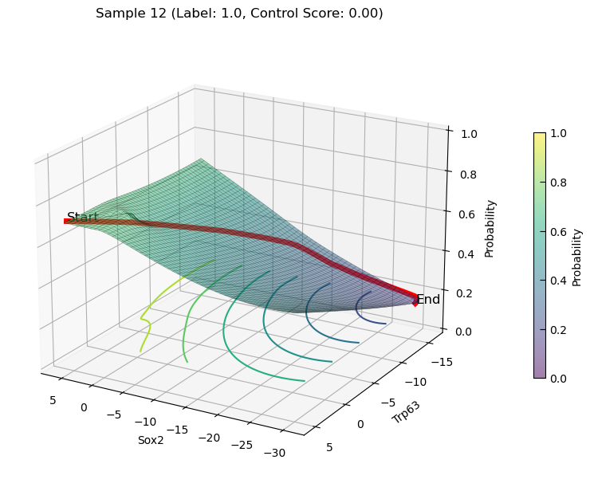

# Mouse LUAS

## import necessary packages for CauFinder


```python
#!/usr/bin/env python
# coding: utf-8

import os
from math import ceil, floor
from typing import Dict, List, Optional, Union
import torch
import torch.nn as nn
import torch.optim as optim
import numpy as np
import pandas as pd
from statistics import stdev
from numpy import nanstd, isnan, nan
import random
from scipy import linalg
from anndata import AnnData, concat
from sklearn.datasets import make_blobs
from sklearn.preprocessing import StandardScaler
from sklearn.feature_selection import mutual_info_classif
from CauFinder.dataloader import zscore_normalization, apply_activation
from CauFinder.benchmark import run_caufinder121
import chardet
from CauFinder.caufinder_main import CausalFinder
from CauFinder.benchmark import cumulative_weight_sum_rate
from scipy.stats import mannwhitneyu, ttest_ind
from sklearn.decomposition import PCA
from CauFinder.utils import set_seed, plot_feature_boxplots, merge_basic_driver, merge_complex_driver
import seaborn as sns
import matplotlib.pyplot as plt
from sklearn.decomposition import PCA
from CauFinder.utils import load_luas_human_adata, load_luas_mouse_adata, human_all_adata, human_data_direction, calculate_w1_w2, find_index
from CauFinder.utils import result_add_direction, plot_control_scores, plot_control_scores_by_category
from CauFinder.utils import plot_3d_state_transition, plot_causal_feature_transitions
import umap
import scanpy as sc
import pickle as pkl
import collections as ct
import warnings
```


## set for figure saving


```python
warnings.filterwarnings("ignore")
plt.rcParams['pdf.fonttype'] = 42
plt.rcParams['font.sans-serif'] = ['Arial']
plt.rcParams['font.family'] = 'sans-serif'
```

## Set path for read files and save output


```python
# Set base and output directories
BASE_DIR = "./CauFinder-master"
case_dir = os.path.join(BASE_DIR, 'LUAS', 'mouse')
data_path = os.path.join(case_dir, 'data')
output_path = os.path.join(case_dir, 'output', 'final_model')
os.makedirs(output_path, exist_ok=True)
```

## run CauFinder (one seed example)


```python
set_seed(seed)

model_folder_path = os.path.join(save_path, r"model")
if not os.path.exists(model_folder_path):
    # make new dir
    os.makedirs(model_folder_path)
model_path = os.path.join(model_folder_path, f"model_{seed}.pkl")
if os.path.exists(model_path):
    print(f"Model file {model_path} found. Loading model...")
    with open(model_path, 'rb') as file:
        model = pkl.load(file)
else:
    # train model
    model = CausalFinder(
        adata=adata,
        # n_controls=n_controls,
        n_latent=25,
        n_causal=5,
        n_hidden=128,
        n_layers_encoder=0,
        n_layers_decoder=0,
        n_layers_dpd=0,
        dropout_rate_encoder=0.0,
        dropout_rate_decoder=0.0,
        dropout_rate_dpd=0.0,
        use_batch_norm='none',
        use_batch_norm_dpd=True,
        pdp_linear=True,
        # init_weight=init_weight,
    )
    # print(model)
    model.train(max_epochs=400, stage_training=True)
    with open(model_path, 'wb') as file:
        pkl.dump(model, file)

# Analyze using SHAP method
shap_results = model.get_driver_info('SHAP', prior_network, save_path, corr_cutoff=0.99, normalize=False,
                                     fig_name=f"shap_driver_weight_{seed}.png")
# Analyze using Grad method
grad_results = model.get_driver_info('Grad', prior_network, save_path, corr_cutoff=0.99, normalize=False,
                                     fig_name=f"grad_driver_weight_{seed}.png")

# Merge SHAP and Grad driver results 
driver_info = merge_complex_driver(*shap_results, *grad_results)
drivers = driver_info.index.to_list()
```

    training: 100%|██████████| 400/400 [00:22<00:00, 17.65it/s]


    Adding 275 additional edges to the network
    Number of nodes: 1940
    Number of edges: 19820
    Identifying driver regulators...
      Solving MFVS problem...
        41 critical nodes are found.
        292 nodes left after graph reduction operation.
        Solving the Integer Linear Programming problem on the reduced graph...
          Solving by GUROBI...(optimal value with GUROBI:20.98699758340224,  status:optimal)
      62 MFVS driver nodes are found.
      50 top-rank genes are found.
    The number of causal FVS driver: 30
    ... ...
    ... ...
    Adding 275 additional edges to the network
    Number of nodes: 1940
    Number of edges: 19820
    Identifying driver regulators...
      Solving MFVS problem...
        41 critical nodes are found.
        292 nodes left after graph reduction operation.
        Solving the Integer Linear Programming problem on the reduced graph...
          Solving by GUROBI...(optimal value with GUROBI:20.991485956326304,  status:optimal)
      62 MFVS driver nodes are found.
      50 top-rank genes are found.
    The number of causal FVS driver: 31


    

    


    

    


## loading exist model and driver information(output of CausalFinder)


```python
# Load driver information and the model (50 runs)
driver_info_path = os.path.join(output_path, 'driver_summary_shap_total.csv')
driver_info = pd.read_csv(driver_info_path, index_col=0)
driver_info = driver_info[driver_info['counts'] > 10]
drivers = driver_info.index.to_list()

# Load the model
model_path = os.path.join(data_path, 'model_25.pkl')
with open(model_path, 'rb') as file:
    model = pkl.load(file)
```

### plot PCA with probabilities (state 0 and 1)


```python
# Plot PCA with probabilities (state 0 and 1)
adata_filter = model.adata.copy()
adata_filter.obs['probs'] = model.get_model_output(adata_filter)['probs']
model.plot_pca_with_probs(adata_filter, save_dir=output_path, elev=20, azim=60)
```


    

    


## run state transition


```python
# transition from 0 -> 1
adata_increase = model.guided_state_transition(
    adata=model.adata,
    causal_features=drivers,
    lambda_reg=1e-6,
    lr=0.2,
    max_iter=500,
    stop_thresh=0.0,
    target_state=1,
    iter_norm=False,
)
```

    Processing sample 0, Target direction: increase
    Processing sample 1, Target direction: increase
    Processing sample 2, Target direction: increase
    Processing sample 3, Target direction: increase
    Processing sample 4, Target direction: increase
    Processing sample 5, Target direction: increase
    Processing sample 6, Target direction: increase
    Processing sample 7, Target direction: increase
    Processing sample 8, Target direction: increase
    Processing sample 9, Target direction: increase
    ... ...
    ... ...
    Processing sample 18, Target direction: increase
    Processing sample 19, Target direction: increase


```python
## transition from 1 -> 0
adata_decrease = model.guided_state_transition(
    adata=model.adata,
    causal_features=drivers,
    lambda_reg=1e-6,
    lr=0.2,
    max_iter=500,
    stop_thresh=0.0,
    target_state=0,
    iter_norm=False,
)
```

    Processing sample 0, Target direction: decrease
    Processing sample 1, Target direction: decrease
    Processing sample 2, Target direction: decrease
    Processing sample 3, Target direction: decrease
    Processing sample 4, Target direction: decrease
    Processing sample 5, Target direction: decrease
    Processing sample 6, Target direction: decrease
    Processing sample 7, Target direction: decrease
    Processing sample 8, Target direction: decrease
    Processing sample 9, Target direction: decrease
    ... ...
    ... ...
    Processing sample 18, Target direction: decrease
    Processing sample 19, Target direction: decrease


## drawing state transition score on PCA

### PCA plot for data


```python
# Draw PCA plots
test_adata = adata_filter.copy()
sc.pp.highly_variable_genes(test_adata, min_mean=0.0125, max_mean=3, min_disp=0.5)
sc.pl.highly_variable_genes(test_adata)

test_adata.raw = test_adata
test_adata = test_adata[:, test_adata.var.highly_variable]

sc.tl.pca(test_adata, svd_solver="arpack", n_comps=5)
sc.pl.pca(test_adata, color='time')
```

    

    

    

    


### mark on time point and sample ID


```python
# Combine data for further plotting
df1 = test_adata.obs
df2 = adata_increase.uns['control_details']
df2.index = df1.index
test_adata.obs = pd.concat([df1, df2], axis=1)

# Plot PCA with scores and save plots
fig, ax = plt.subplots(figsize=(15, 15))
sc.pl.pca(test_adata, color='time', legend_loc="on data", size=1200, legend_fontsize=16, palette="Set2",
          frameon=False, add_outline=True, outline_width=(0.05, 0.05), return_fig=True)
plt.savefig(os.path.join(output_path, 'mouse_pca_time.pdf'), bbox_inches='tight')

fig, ax = plt.subplots(figsize=(15, 15))
sc.pl.pca(test_adata, color='time', frameon=False, add_outline=True, outline_width=(0.05, 0.05), ax=ax, return_fig=False)
```

    

    


```python
for i, txt in enumerate(test_adata.obs['sample_idx']):
    ax.annotate(txt, (test_adata.obsm['X_pca'][i, 0], test_adata.obsm['X_pca'][i, 1]),
                fontsize=20, color='black', ha='center', va='center')
plt.show()
```

    

    


### color with state transition score


```python
test_adata.obs['norm_score'] = [(i - min(test_adata.obs['score'])) / (max(test_adata.obs['score']) - min(test_adata.obs['score'])) for i in test_adata.obs['score']]

fig, ax = plt.subplots(figsize=(15, 15))
sc.pl.pca(test_adata, color='norm_score', size=1200, legend_fontsize=16, palette="Set2",
          frameon=False, add_outline=True, outline_width=(0.05, 0.05), return_fig=True)
plt.savefig(os.path.join(output_path, 'mouse_pca_norm_score.pdf'), bbox_inches='tight')
```

    

    


    

    


### color with state transition score(only 9W-10W)


```python
# Further PCA plots for specific time points
test_adata2 = adata_filter.copy()
test_adata2 = test_adata2[[i in ['9W', '10W'] for i in test_adata2.obs['time']],]
sc.pp.highly_variable_genes(test_adata2, min_mean=0.0125, max_mean=3, min_disp=0.5)
test_adata2.raw = test_adata2
test_adata2 = test_adata2[:, test_adata2.var.highly_variable]
sc.tl.pca(test_adata2, svd_solver="arpack", n_comps=2)

df1 = test_adata2.obs
df2 = adata_decrease.uns['control_details'][12::]
df2.index = df1.index
test_adata2.obs = pd.concat([df1, df2], axis=1)

test_adata2.obs['norm_score'] = [(i - min(test_adata2.obs['score'])) / (max(test_adata2.obs['score']) - min(test_adata2.obs['score'])) for i in test_adata2.obs['score']]

fig, ax = plt.subplots(figsize=(15, 15))
sc.pl.pca(test_adata2, color='norm_score', legend_loc="on data", size=1200, legend_fontsize=16, palette="Set2",
          frameon=False, add_outline=True, outline_width=(0.05, 0.05), return_fig=True)
plt.savefig(os.path.join(output_path, 'mouse_decrease_pca_norm_score.pdf'), bbox_inches='tight')
```
    

    


```python
fig, ax = plt.subplots(figsize=(15, 15))
sc.pl.pca(test_adata2, color='sample_name', legend_loc="on data", size=1200, legend_fontsize=16, palette="Set2",
          frameon=False, add_outline=True, outline_width=(0.05, 0.05), return_fig=True)
sc.pl.pca(test_adata2, color='sample_name', legend_loc="on data", size=1200, legend_fontsize=16, palette="Set2", na_color='gray')
plt.savefig(os.path.join(output_path, 'mouse_decrease_name_norm_score.pdf'), bbox_inches='tight')
```

    

    


## draw 3D state transition plot for sample


```python
# set plot path
save_path = os.path.join(output_path, 'final_model')
os.makedirs(save_path, exist_ok=True)
```

### increasing state transition on PCs


```python
plot_3d_state_transition(adata_increase, sample_indices=[11, 8], use_pca=True, save_path=save_path, elev=20, azim=120)
```
    

    

    

    

### increasing state transition on Features(Smad4 and Myc)


```python
plot_3d_state_transition(adata_increase, sample_indices=[11, 8], use_pca=False, feature1='Smad4', feature2='Myc', add_key='Smad4_Myc', save_path=save_path, elev=20, azim=120)
```
    

    

    

    

### increasing state transition on Features(Sox2 and Trp63)


```python
plot_3d_state_transition(adata_increase, sample_indices=[11, 8], use_pca=False, feature1='Sox2', feature2='Trp63', add_key='Sox2_Trp63', save_path=save_path, elev=20, azim=120)
```
    

    
    

    

### decreasing state transition Plot


```python
plot_3d_state_transition(adata_decrease, sample_indices=[12, 15], use_pca=True, save_path=save_path, elev=20, azim=30)
plot_3d_state_transition(adata_decrease, sample_indices=[12, 15], use_pca=False, feature1='Smad4', feature2='Myc', add_key='Smad4_Myc', save_path=save_path, elev=20, azim=120)
plot_3d_state_transition(adata_decrease, sample_indices=[12, 15], use_pca=False, feature1='Sox2', feature2='Trp63', add_key='Sox2_Trp63', save_path=save_path, elev=20, azim=120)
```
    

    


    

    

    

    

    

    

    

    

    

    
